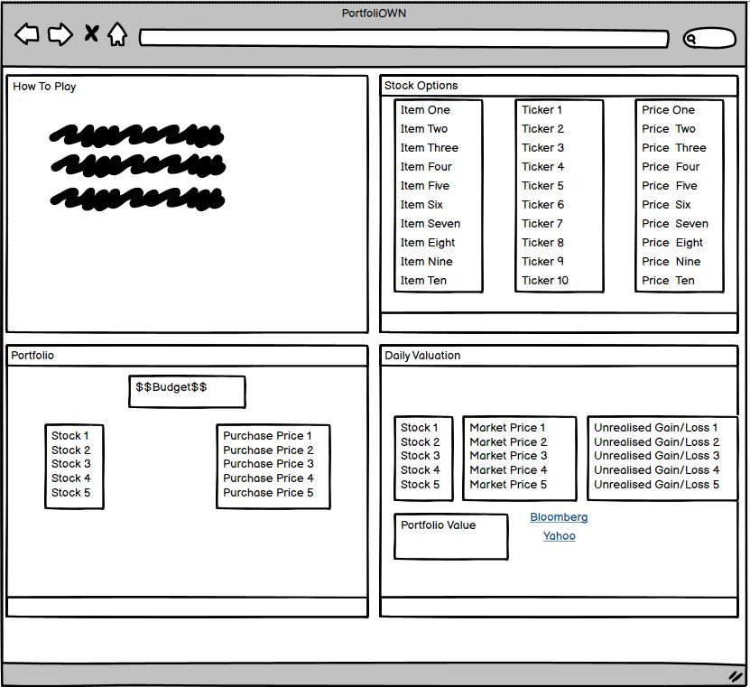
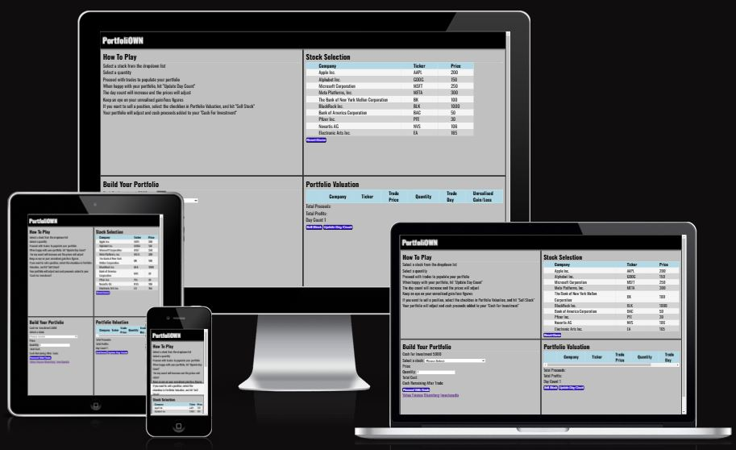

# PortfoliOWN ReadMe Document

Welcome, all!  

This document aims to explain the who, what, why, and how of this website.

## PortfoliOWN

PortfoliOWN is a stock simulator designed to be an intuitive and fun way of learning about buying, selling and realising profits/losses in investments.
As a user, I want to simulate stock sortfolio construction so that I can see how daily changes affect my stocks, cash and profits (realised and unrealised). I have a full description of the game layout and operation. I can buy and sell stocks in a simulated portfolio. I can make decisions on when to buy/sell a stock based on market prices and profit/loss.

## Initial Design - Wireframe
The original idea was to have 4 boxes, 2 up/2 down, and fill those with sections with "How to Play" - Box 1, "Stock Selection" (10 stocks) - Box 2, "Build your Portfolio" - Box 3 & "Portfolio Valuation" - Box 4.  The data in each of box 2, 3, & 4 will be used together to build a portfolio and reflect the cost, unrealised gain/loss, and profit.

## General Features

### Responsive Design
The website was designed to ensure that the user can enjoy playing this game on all screen sizes.

### Simulated Stock Prices
PortfoliOWN randomises the daily stock prices using a range of +/-2% day-on-day. 

### Daily Valuations
The stocks in your portfolio are valued each day, the same as in real life.  This gives the user an idea of the unrealised gains/losses on their stock selections.

### Links to External Websites
There are links to Yahoo and Bloomberg for stock quotes and also to Investopedia to learn about investments and the stock market.

## Testing
### Code Validation
All 3 files were put through their respective validator tools:

#### HTML - No errors or warnings

#### CSS - No errors, 1 warning
There was one warning - "Imported style sheets are not checked in direct input and file upload modes".  This was my import from Google Fonts and is an expected warning.

#### JSHint

### Functional Testing
<table>
    <tr>
        <th>Action</th>
        <th>Expected Behaviour</th>
        <th>Pass/Fail</th>
    </tr>
    <tr>
        <td>Page URL</td>
        <td>Deployed page to open</td>
        <td>Pass</td>
    </tr>
    <tr>
        <td>Page Responsiveness</td>
        <td>Pages are responsive to mobile, tablet and desktop users</td>
        <td>Pass</td>
    </tr>
    <tr>
        <td>External Links</td>
        <td>External website links work and open in new page</td>
        <td>Pass</td>
    </tr>
    <tr>
        <td>Relative Filepaths</td>
        <td>All relative filepaths function correctly to display correct content</td>
        <td>Pass</td>
    </tr>
    <tr>
        <td>Daily Price Simulation</td>
        <td>All prices are updating to within +/-2% and displaying correctly</td>
        <td>Pass</td>
    </tr>
    <tr>
        <td>Stock Dropdown</td>
        <td>All stocks have been pushed to the dropdown list from JS</td>
        <td>Pass</td>
    </tr>
    <tr>
        <td>Selected Stock For Purchase</td>
        <td>The selected stock is pushed to the Portfolio table in Portfolio Valuation</td>
        <td>Pass</td>
    </tr>
    <tr>
        <td>Game Calculations</td>
        <td>All calculations - Cost, Proceeds, Unrealised gain/loss, Profit, Cash On Hand - Calculate as expected</td>
        <td>Pass</td>
    </tr>
    <tr>
        <td>Physical Test</td>
        <td>Website tested on users and their various devices</td>
        <td>Pass</td>
    </tr>
</table>

### Browser Performance
the game performed well on the below browsers:
<ul>
    <li>Google Chrome</li>
    <li>Microsoft Edge</li>
    <li>Mozilla Firefox</li>    
    <li>Safari</li>
</ul>

### Lighthouse Checks

#### Lighthouse Desktop Check

#### Lighthouse Mobile Check

### Bug Fixes
Bugs that were discovered and fixed are as follows:
<ul>
    <li>Missing semicolons (JS)</li>
    This was fixed by including semicolons to the end of the JS code.
    <li>Stray Start Tag (HTML)</li>
    This was fixed by removing the header.
    <li>Users able to buy stocks even when cash was depleted(JS)</li>
    This was fixed by including the resetBuySection() to "function adjustPortfolio(stock)" & "function updateCashUI(stock)" code.
</ul>

## Known Bugs
Bugs that remain due to time contraints are as follows:
<ul>
    <li>Selling lots with both gains and losses included (JS)</li>
    The sum of the Gain/Loss should be colour coded by green (Profit) or red (Loss).
    If the last lot selected in a group for sale is red, but the proceeds indicate a profit, this will show red and vice versa:
</ul>

<ul>
    <li>Selecting a stock for sale, deselecting it, then reselecting it for sale (JS)</li>
    The profit/loss is calculated upon selection of a stock for sale from the portfolio.  If this is deselected, the profit/loss remains.  If the stock is reselected, the profit/loss figure is added to each time.  This, however, does not actually affect the cash proceeds in the game.  Once the stock is sold, the correct monetary value of that stock, inclusive of actual P&L, is added back to cash on hand. 
</ul>

### Upon selection - Works correctly:

### Upon deselection & subsequent reselection - Adds to the prior selected balance:

## Deployment
The site was deployed through GitHub.  The steps taken were:
<ul>
    <li>Go to settings</li>
    <li>Select pages and apply "Deploy from branch" on the Source dropdown</li>
    <li>Our branch is set to "main" with "/root" as the folder</li>
</ul>

## Credits
### The following websites were used for informational purposes:

[Stack Overflow - General Queries](https://stackoverflow.com/)

[W3 Schools - General Queries](https://www.w3schools.com/)

[MDN Web Docs - General Queries](https://developer.mozilla.org/en-US/)

### The following websites were used visual purposes:

[Google Fonts](https://fonts.google.com/)

[Favicon - Head Icon](https://favicon.io/emoji-favicons/drum/)

### The following projects were referenced in relation to HTML, CSS & JavaScript:

[Love Running Essentials Project](https://github.com/Code-Institute-Solutions/love-running-v3/tree/main/)

[Love Maths Essentials Project](https://github.com/Code-Institute-Solutions/love-maths-2.0-sourcecode/tree/master/)

